# Vendor Management System

Vendor Management System using Django and Django REST Framework. This
system will handle vendor profiles, track purchase orders, and calculate vendor performance
metrics.


## How to Install and Run the Project

### System Requirements -

[Python 3.10.12](https://www.python.org/downloads/) or greater should be installed in your system for running python files.

If you are working on Ubuntu, there is no need to install Python explicitly as it is already included in the Ubuntu distribution.

1. Open the Terminal (on macOS or Linux) or Command Prompt (on Windows) on your system.
2. Navigate to your desired location using the cd command.
3. Create a new directory using the mkdir command followed by the name of the directory.

```bash
$ mkdir Fatmug_Designs
$ cd Fatmug_Designs
```

In Fatmug_Designs directory create a Python Virtual Environment.

Run the below command to install, create and activate python virtual environment.

#### For Windows operating system -
```bash
$ pip install virtualenv
$ virtualenv venv
$ .\venv\Scripts\activate
```

#### For Ubuntu (Linux) operating system -
```bash
$ pip install virtualenv
$ python3 -m venv venv
$ source venv/bin/activate
```
Where, venv is the name of virtual environment created.

After that, a namespace _(venv)_ is shown in the beginning of command line denoting that your virtual environment is activated successfully.
```bash
(venv) <YOUR_SYSTEM_NAME> :~
```

Clone the project's repository on your local system by executing the command:

```bash
$ git clone https://github.com/KrishnakantSinghal/fatmug-designs.git
```

Navigate to the directory of the cloned project using the following commands:

```bash
$ cd fatmug-designs/
$ cd fatmug_designs/
```

To install the project requirements, execute the following command:
```bash
$ pip install -r requirements.txt
```

The installation of all the requirements for the project will take approximately 15 to 30 seconds, depending on your internet connection speed and system hardware.

After the successful installation of the requirements, run the following command to create the database and table structures for storing data:
```bash
$ python3 manage.py migrate
```

This process will take approximately 5 to 10 seconds, depending on your system's hardware.

Once the migrations have been successfully executed, create an Admin User/Super User to manage the platform by running the following command:
```bash
$ python3 manage.py createsuperuser
```

Enter the required details to create admin user:
```bash
Username: admin
Email address: admin@admin.com
Password: admin
Password (again): admin
The password is too similar to the username.
This password is too short. It must contain at least 8 characters.
This password is too common.
Bypass password validation and create user anyway? [y/N]: y
```

Press Enter after entering one detail at a time.

Email is not compulsory; you can leave this blank by pressing Enter.

The password may not be visible while entering it, as it is a crucial detail. Enter the password carefully, ensuring it matches the _"Password (again)"_.

Project setup completed!

Now, import the collection file into Postman for managing API endpoints.
The collection file is named _fatmug_Designs.postman_collection.json_.

## API Endpoints 

All the APIs are authenticated for admin users only, meaning only admins/superusers can access the APIs.
After successfully obtaining the access token, the admin user can perform the required operations using the APIs.

#### 1. Admin Tokens API ([POST] _localhost:8000/api/admin-tokens/_) -
The first API is designed to retrieve tokens for the admin user by entering the admin user's credentials.
These tokens will be utilized to ensure the authenticity of other APIs.

The payload requires two parameters: _username_ and _password_.
Upon making a request to the API, it will provide both access and refresh tokens as a response with a response code of 200.

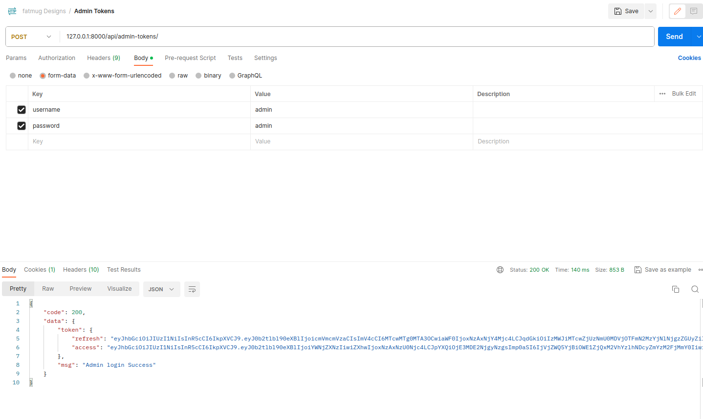

After obtaining the tokens, copy the access token and paste it into the Authorization section, using the type _"Bearer Token,"_ for all other API endpoints.

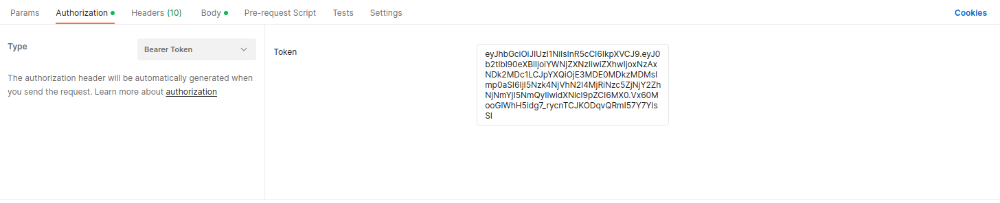

Your API is now authenticated.

#### 2. Admin Refresh Token ([POST] _localhost:8000/api/admin_refresh_token//_) -
This API is utilized to refresh the access token of an admin when their current access token has expired.

The payload for this API requires one parameter: _refresh_, which is the refresh token of the admin user.

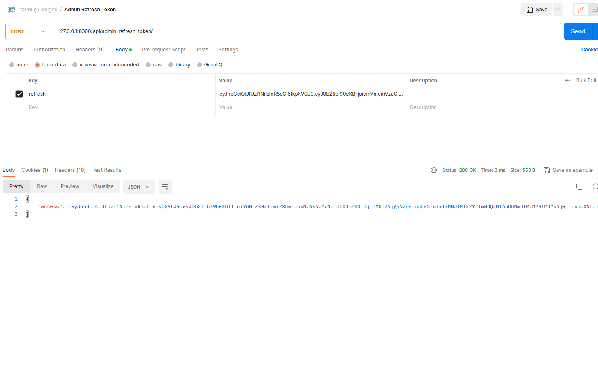
Upon successful execution, this API will respond with a new access token with a response code of 200.

#### 3. Create Vendor API ([POST] _localhost:8000/api/vendors/_) -
This API is designed to create vendors. It is an authenticated API, and only admin users have the privilege to create vendors for the platform.

The payload for this API requires three parameters: _name_, _contact_details_, and _address_. 
After successfully hitting the API with the correct payload, 
it will respond with a message _"Vendor Created Successfully"_ and a response code of 201.

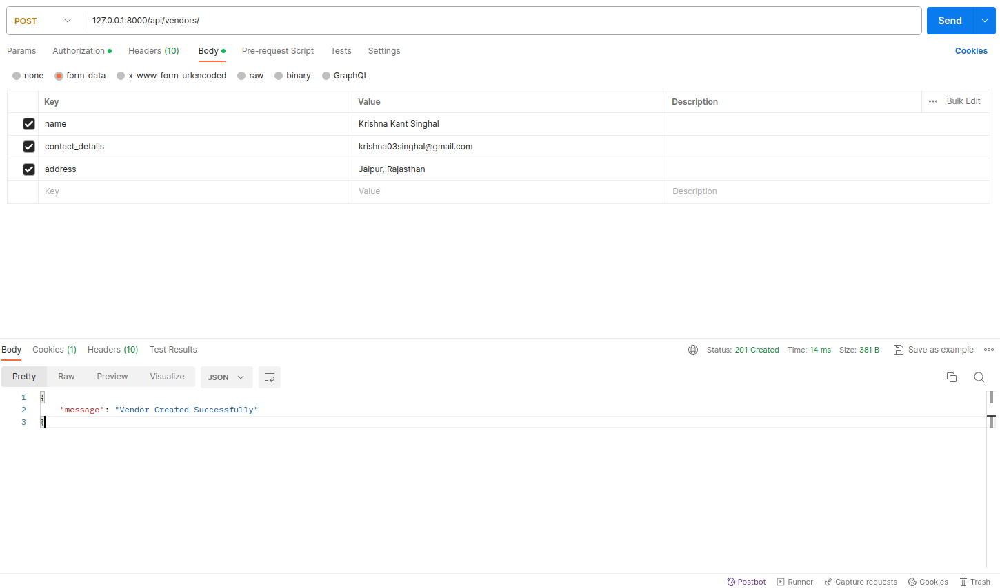

#### 4. List of all Vendors ([GET] _localhost:8000/api/vendors/_) -
This API is employed to retrieve all vendor details present in the database. It is an authenticated API, and only admin users have the authority to view vendors. 

No arguments need to be passed for this API.

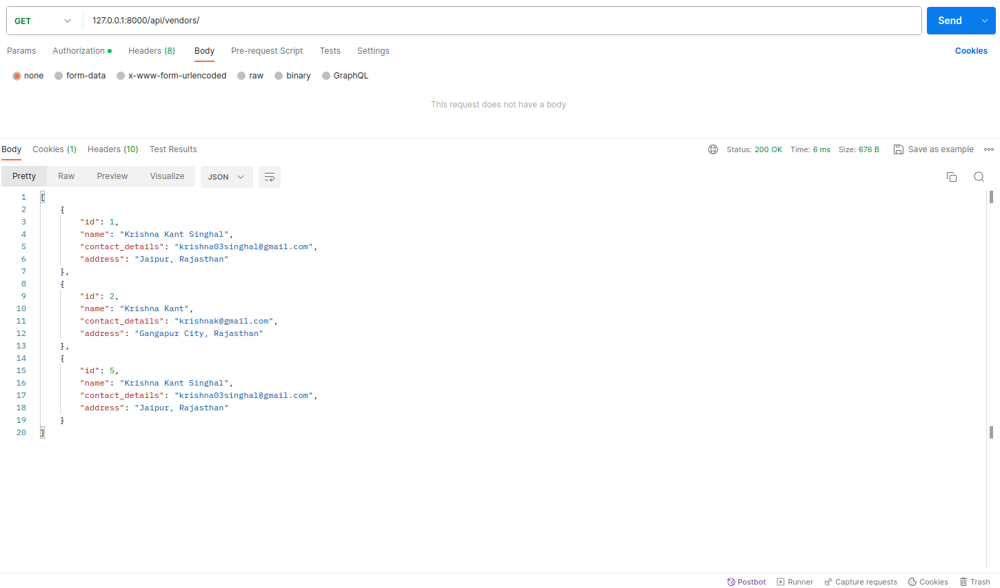

#### 5. Single Vendor Details ([GET] _localhost:8000/api/vendors/<vendor_id>_) -
This API is utilized to retrieve all the details of a single vendor.
This is an authenticated API, and only admin users have the authorization to view vendor details.

To get the details of a specific vendor, pass a keyword argument _vendor_id_ of type integer when making a request to this API.


Where, **2** is vendor_id for a particular vendor.

#### 6. Update Vendor Details ([PUT] _localhost:8000/api/vendors/<vendor_id>_) -
This API is employed to update a vendor's details/data for a specific vendor.
This is an authenticated API, and only admin users have the authority to update vendor details.

To update the details of a specific vendor, include a keyword argument _vendor_id_ of type integer when making a request to this API. 
This allows the API to identify and update the details for the vendor with the specified ID.

In the payload, you may pass three parameters: _name_, _contact_details_, and _address_. 
The admin has the flexibility to update any of these details for the particular vendor. 
After successfully hitting the API with the correct payload, 
it will respond with a message _"Your details are updated successfully"_ and a response code of 200.

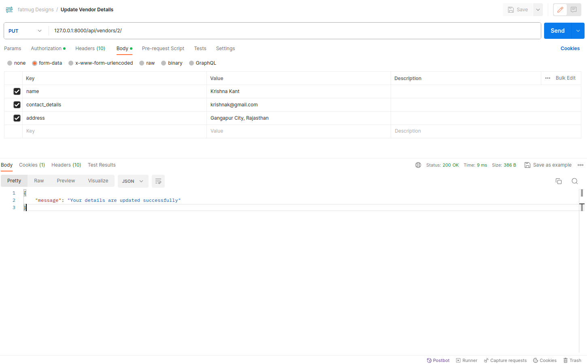
Where, **2** is vendor_id for a particular vendor.

#### 7. Delete Vendor ([DELETE] _localhost:8000/api/vendors/<vendor_id>_) -
This API is designed to delete a vendor from the database. It is an authenticated API, 
and only admin users have the authority to delete vendors.

To delete a vendor with a specific ID, include a keyword argument _vendor_id_ of type integer when making a request to this API. 
This allows the API to identify and delete the vendor with the specified ID.

After successfully hitting the API,
it will respond with a message _"Vendor deleted successfully"_ and a response code of 200.

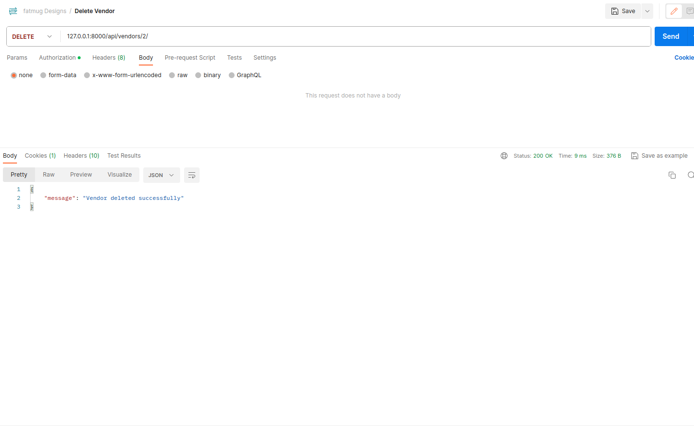
where, **2** is vendor_id for a particular vendor.

#### 8. Create Purchase Order ([POST] _localhost:8000/api/purchase_orders/_) -
This API is utilized to create a purchase order for a particular vendor.
It is an authenticated API, and only admin users have the authorization to create purchase orders.

In the payload, you may pass six parameters: _vendor_, _delivery_date_, _order_date_, _items_, _quality_rating_, and _status_. 
After successfully hitting the API with the correct payload, it will respond with a message _"Purchase Order Created Successfully"_
and a response code of 201.

When creating a purchase order for a particular vendor, this API will also update the performance metrics of the vendor.
Additionally, it will generate an instance in Historical Performance. 
The update in performance metrics depends on the status of the purchase order. 
If the status is "complete," it will set the purchase order as acknowledged, 
and the acknowledged date will be recorded in the database for the purchase order instance.

The status of the purchase order can be one of three choices: "complete," "pending," or "canceled." 
The items parameter should be a list of dictionaries, where name and quantity are the keys.

This API will also update the total quantity of items for the specific purchase order, 
and vendor will be the ID of the vendor associated with the purchase order.

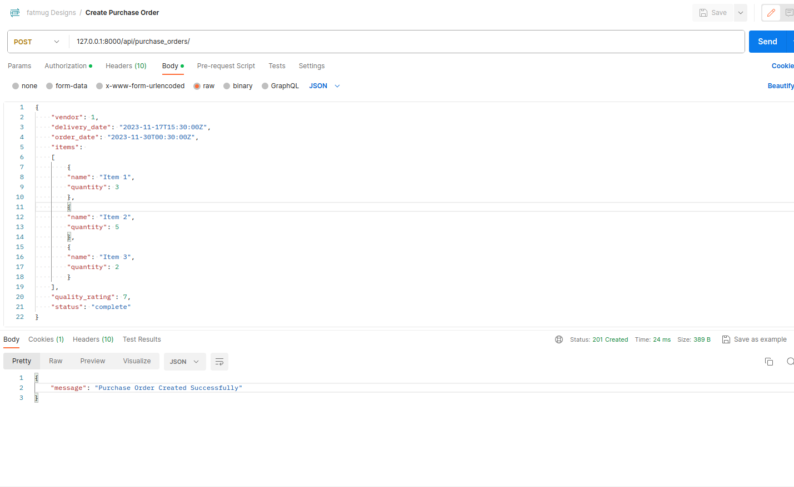
After successfully processing the request, this API will respond with a message _"Purchase Order Created Successfully"_
and a response code of 201.

#### 9. Create Purchase Order ([GET] _localhost:8000/api/purchase_orders/_) -
This API is employed to retrieve all the details of all purchase orders in the database. 
It is an authenticated API, and only admin users have the authorization to retrieve purchase orders.

No arguments need to be passed for this API.

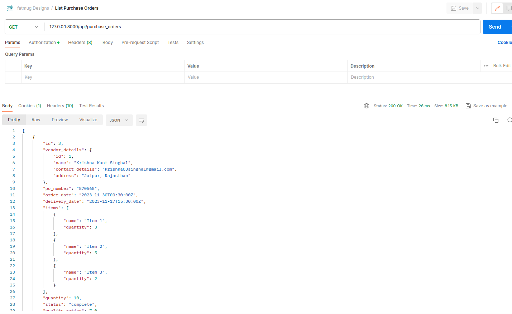

#### 10. List Purchase Orders for a Vendor ([GET] _localhost:8000/api/purchase_orders/?vendor_id=<vendor_id>_) -
This API is utilized to retrieve all the details of all purchase orders for a particular vendor in the database.
It is an authenticated API, and only admin users have the authorization to retrieve purchase orders.

To retrieve purchase orders for a specific vendor, include a query parameter _vendor_id_ of type integer when making a request to 
this API. This allows the API to filter and retrieve purchase orders associated with the specified vendor ID.


where, **1** is the _vendor_id_ for a particular vendor.

#### 11. Retrieve Purchase Order details for a particular purchase_id ([GET] _localhost:8000/api/purchase_orders/<po_id>_) -
This API is designed to retrieve all the details of a particular purchase order in the database.
It is an authenticated API, and only admin users have the authorization to retrieve purchase orders.

To retrieve details of a specific purchase order, include a keyword argument _po_id_ (purchase order's ID) 
of type integer when making a request to this API. This allows the API to identify and retrieve the details of the specified purchase order.

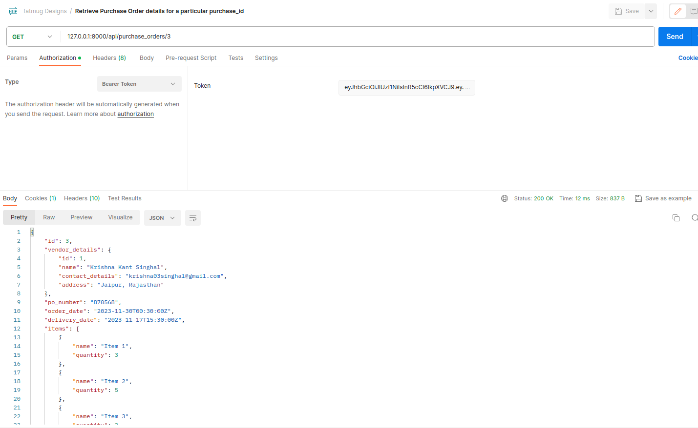
where, **3** is the id for a particular purchase order.

#### 12. Update Purchase Order ([PUT] _localhost:8000/api/purchase_orders/<po_id>_) -
This API is used to update a purchase order with the given _po_id_. It is an authenticated API, 
and only admin users have the authorization to update purchase orders.

Pass a keyword argument _po_id_ (purchase order's ID) of type integer for this API to update the purchase order. 
In the payload, two parameters are required: _quality_rating_ and _status_. 
This API will update two fields for a particular purchase order - _quality_rating_ and _status_. 
If the status is _"complete"_, it will acknowledge the purchase order, and the _acknowledgment_date_ will be set for that particular purchase order.
If the status is not _"complete"_, it will not be acknowledged.

Additionally, this API will generate an instance in Historical Performance and update the performance metrics for a particular vendor.
There can be three choices for the status: _"complete"_, _"pending"_ or _"canceled"_.

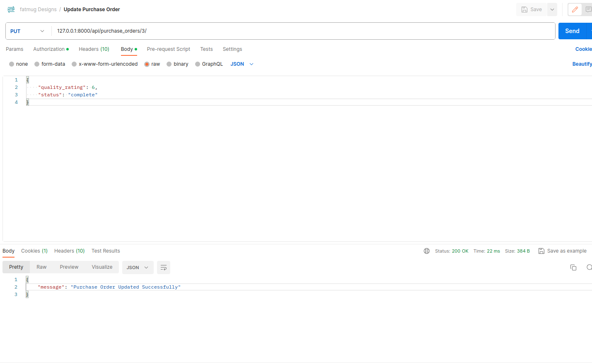
Upon successfully processing the request, this API will respond with a message _"Purchase Order Updated Successfully"_ and a response code of 200.

#### 13. Purchase Order Delete ([DELETE] _localhost:8000/api/purchase_orders/<po_id>_) -
This API is employed to delete a purchase order with the given _po_id_. 
It is an authenticated API, and only admin users have the authorization to delete purchase orders.

Pass a keyword argument _po_id_ (purchase order's ID) of type integer for this API to delete the specified purchase order.

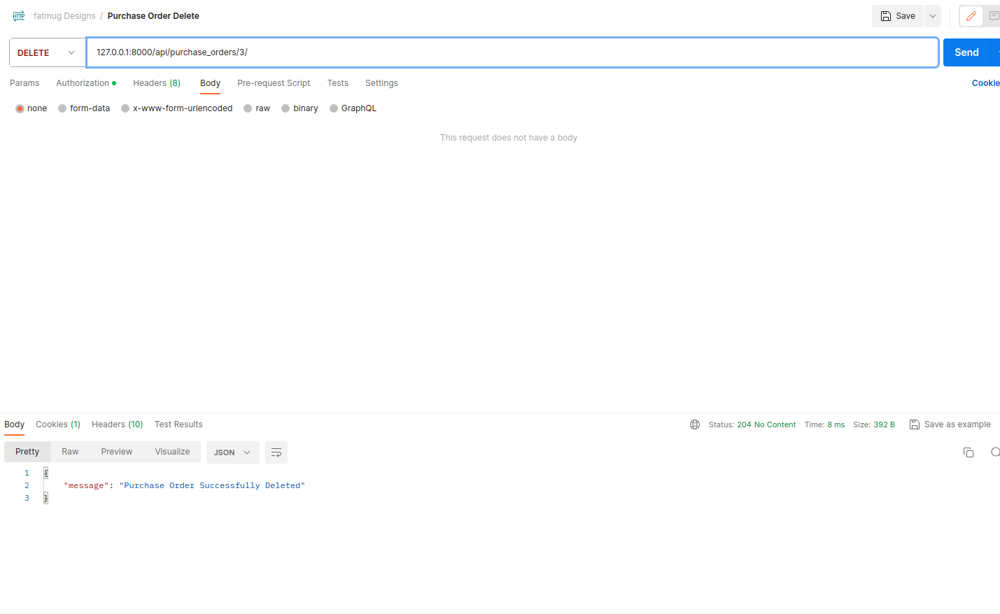
Where, 3 is the id of purchase order.

Upon successful deletion, the API will respond with a message _"Purchase Order Successfully Deleted"_ and a response code of 204.

#### 14. Get Performance Metrics ([GET] _localhost:8000/api/vendors/<vendor_id>/performance_) -
This API is designed to retrieve the performance metrics of a particular vendor with the given _vendor_id_. 
It is an authenticated API, and only admin users have the authorization to retrieve performance metrics.

Pass a keyword argument _vendor_id_ (vendor's ID) of type integer when making a request to this API.
This allows the API to identify and retrieve the performance metrics for the specified vendor.

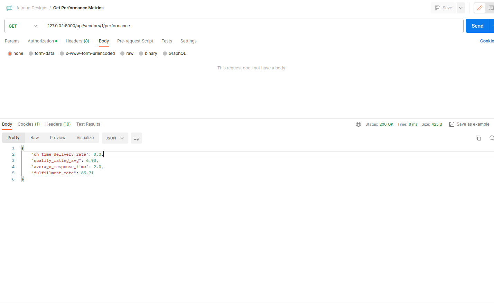
Where, 1 is the id of a vendor.

#### 15. Update Acknowledgement ([POST] _localhost:8000/api/purchase_orders/<po_id>/acknowledge_) -
This API is utilized to acknowledge a purchase order. 
It will update the status of the purchase order to _"complete"_ and create a historical performance record for the vendor. 
Additionally, _acknowledgement_date_ will be set for the particular purchase order. 
The performance metrics of the vendor will also be updated as part of this acknowledgement process.

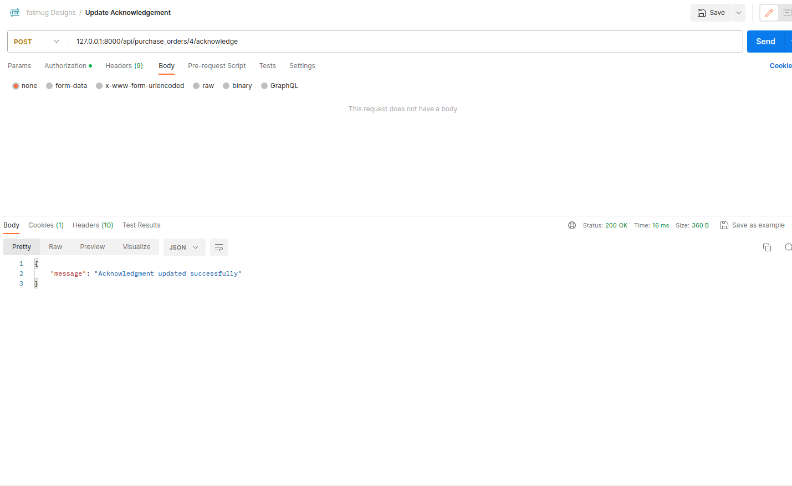
Upon successfully processing the acknowledgment, this API will respond with a message "Acknowledgment updated successfully"
and a status code of 200.
